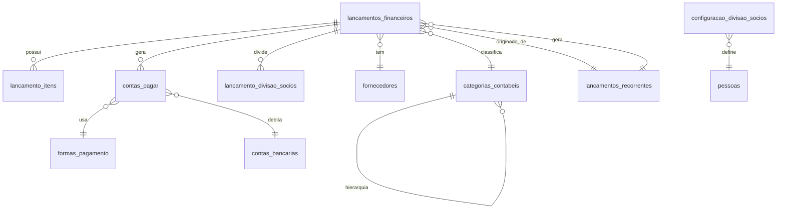

# Sistema Financeiro Respira Kids - Documentação Completa

## Índice

1. [Visão Geral](#visão-geral)
2. [Arquitetura do Sistema](#arquitetura-do-sistema)
3. [Funcionalidades](#funcionalidades)
4. [Guia de Uso](#guia-de-uso)
5. [Integrações](#integrações)
6. [Configurações](#configurações)
7. [Troubleshooting](#troubleshooting)
8. [Referência Técnica](#referência-técnica)

## Visão Geral

O Sistema Financeiro Respira Kids é uma solução completa para gestão financeira da clínica, oferecendo controle de receitas, despesas, contas a pagar, divisão entre sócios e relatórios gerenciais.

### Principais Características

- **Controle de Lançamentos**: Despesas e receitas com múltiplos itens
- **Contas a Pagar/Receber**: Gestão de vencimentos e pagamentos
- **Divisão entre Sócios**: Customizável por lançamento
- **Lançamentos Recorrentes**: Automatização de despesas fixas
- **Integração com IA**: Processamento automático de notas fiscais
- **Relatórios e Dashboard**: Visão gerencial completa
- **Multi-empresa**: Suporte para diferentes CNPJs

### Perfis de Acesso

- **Admin**: Acesso total ao sistema
- **Secretaria**: Acesso completo exceto relatórios
- **Profissional**: Visualiza apenas suas comissões e divisões

## Arquitetura do Sistema

### Estrutura de Tabelas



### Componentes Frontend

```
src/components/
├── domain/financial/
│   ├── LancamentoForm.tsx         # Formulário de lançamentos
│   ├── LancamentoList.tsx         # Lista de lançamentos
│   ├── ContasPagarList.tsx        # Gestão de contas
│   ├── PagamentoForm.tsx          # Registro de pagamentos
│   ├── PreLancamentoValidation.tsx # Validação de IA
│   ├── LancamentoRecorrenteForm.tsx # Cadastro recorrentes
│   ├── LancamentoRecorrenteList.tsx # Lista recorrentes
│   ├── DivisaoSociosModal.tsx     # Configurar divisão
│   ├── FinancialDashboard.tsx     # Dashboard principal
│   ├── RelatorioMensal.tsx        # Relatórios
│   └── RecorrenciaLogViewer.tsx   # Logs de processamento
├── domain/fornecedores/           # Gestão de fornecedores
├── domain/categorias/             # Categorias contábeis
└── domain/contas-bancarias/       # Contas bancárias
```

## Funcionalidades

### 1. Dashboard Financeiro

**Acesso**: Financeiro > Dashboard

**Métricas Disponíveis**:

- Receitas, Despesas e Saldo do mês
- Comparativo com mês anterior
- Evolução mensal (últimos 6 meses)
- Despesas por categoria
- Contas próximas do vencimento
- Últimos lançamentos

### 2. Lançamentos Manuais

**Acesso**: Financeiro > Receitas/Despesas

**Funcionalidades**:

- Cadastro com múltiplos itens
- Upload de documentos
- Parcelamento automático
- Divisão entre sócios
- Categorização contábil
- Geração automática de contas a pagar

**Campos Principais**:

```json
{
  "tipo_lancamento": "despesa|receita",
  "numero_documento": "NF-123",
  "data_emissao": "2024-01-15",
  "data_competencia": "2024-01-15",
  "fornecedor_id": "uuid",
  "categoria_contabil_id": "uuid",
  "descricao": "Descrição do lançamento",
  "valor_total": 1500.0,
  "quantidade_parcelas": 3,
  "eh_divisao_socios": true,
  "itens": [
    {
      "descricao": "Item 1",
      "quantidade": 10,
      "valor_unitario": 150.0,
      "valor_total": 1500.0
    }
  ]
}
```

### 3. Contas a Pagar/Receber

**Acesso**: Financeiro > Contas a Pagar

**Funcionalidades**:

- Visualização por vencimento
- Alertas de contas vencidas
- Registro de pagamentos
- Seleção múltipla
- Exportação CSV
- Filtros avançados

**Status de Pagamento**:

- `pendente`: Aguardando pagamento
- `pago`: Pagamento confirmado
- `cancelado`: Conta cancelada

### 4. Pré-Lançamentos (Validação IA)

**Acesso**: Financeiro > Pré-Lançamentos

**Fluxo**:

1. IA envia dados via API
2. Sistema cria pré-lançamento
3. Admin/Secretaria valida
4. Lançamento é confirmado ou rejeitado

**Validação em Lote**:

- Selecione múltiplos lançamentos
- Valide ou rejeite todos de uma vez
- Edite antes de validar se necessário

### 5. Lançamentos Recorrentes

**Acesso**: Financeiro > Recorrentes

**Configurações**:

- **Frequência**: Mensal, bimestral, trimestral, semestral, anual
- **Dia de vencimento**: 1 a 31
- **Ajuste fim de semana**: Move para dia útil
- **Período**: Data início/fim
- **Status**: Ativo/Inativo

**Processamento Automático**:

- Executa diariamente às 3h (Brasília)
- Cria lançamentos automaticamente
- Logs disponíveis para consulta

### 6. Cadastros Auxiliares

**Acesso**: Financeiro > Cadastros

#### Fornecedores

- Pessoa Física (CPF) ou Jurídica (CNPJ)
- Integração com API de CEP
- Múltiplas categorias
- Soft delete

#### Categorias Contábeis

- Hierarquia de 3 níveis
- Cores personalizadas
- Códigos únicos
- Visualização em árvore

#### Contas Bancárias

- Múltiplas contas
- Saldo inicial
- Tipos: Corrente/Poupança
- Titular: Clínica ou Pessoa

### 7. Relatórios

**Acesso**: Financeiro > Relatórios (apenas Admin)

**Tipos de Análise**:

- Por período
- Por categoria
- Por fornecedor
- Por sócio (divisões)
- Comparativos

**Exportação**:

- CSV com encoding UTF-8
- Formatação brasileira
- Dados completos

## Guia de Uso

### Cadastrando Primeiro Lançamento

1. **Acesse** Financeiro > Despesas
2. **Clique** em "Novo Lançamento"
3. **Preencha**:
   - Tipo: Despesa
   - Descrição: Ex: "Compra de materiais"
   - Valor: R$ 1.000,00
   - Fornecedor: Selecione ou cadastre
   - Categoria: Selecione a classificação
4. **Adicione itens** se necessário
5. **Configure parcelas** se parcelado
6. **Marque divisão** entre sócios se aplicável
7. **Salve** o lançamento

### Configurando Lançamento Recorrente

1. **Acesse** Financeiro > Recorrentes
2. **Clique** em "Novo Recorrente"
3. **Configure**:
   - Descrição: "Aluguel"
   - Valor: R$ 5.000,00
   - Frequência: Mensal
   - Dia: 10
   - Ajustar fim de semana: ✓
4. **Defina período** se temporário
5. **Salve** e acompanhe processamento

### Registrando Pagamento

1. **Acesse** Financeiro > Contas a Pagar
2. **Localize** a conta pendente
3. **Clique** em "Registrar Pagamento"
4. **Informe**:
   - Data do pagamento
   - Valor pago
   - Forma de pagamento
   - Conta bancária (se aplicável)
5. **Confirme** o pagamento

### Validando Pré-Lançamentos

1. **Acesse** Financeiro > Pré-Lançamentos
2. **Revise** os dados enviados pela IA
3. **Edite** se necessário
4. **Valide** ou **Rejeite**
5. Lançamentos validados geram contas automaticamente

## Integrações

### API REST para n8n

**Endpoint Base**: `https://seu-projeto.supabase.co/rest/v1`

#### Criar Pré-Lançamento

```bash
POST /lancamentos_financeiros
Headers:
  apikey: sua-anon-key
  Authorization: Bearer sua-anon-key
  Content-Type: application/json
  Prefer: return=representation

Body:
{
  "tipo_lancamento": "despesa",
  "numero_documento": "NF-123",
  "data_emissao": "2024-01-15",
  "data_competencia": "2024-01-15",
  "fornecedor_id": "uuid-fornecedor",
  "categoria_contabil_id": "uuid-categoria",
  "descricao": "Compra processada por IA",
  "valor_total": 1500.00,
  "quantidade_parcelas": 1,
  "eh_divisao_socios": true,
  "status_lancamento": "pre_lancamento",
  "origem_lancamento": "api",
  "arquivo_url": "https://storage/doc.pdf"
}
```

#### Buscar Fornecedor por CNPJ

```bash
GET /fornecedores?cpf_cnpj=eq.12345678000190
```

#### Listar Categorias Ativas

```bash
GET /categorias_contabeis?ativo=eq.true&order=nome
```

### Webhooks Disponíveis

Configure no Supabase para receber notificações:

1. **Novo Pré-Lançamento**: Quando IA envia dados
2. **Conta Vencida**: Alertas de vencimento
3. **Pagamento Registrado**: Confirmação de pagamentos

## Configurações

### Divisão entre Sócios

**Tabela**: `configuracao_divisao_socios`

```sql
-- Configurar divisão 50/50
INSERT INTO configuracao_divisao_socios (pessoa_id, percentual_divisao, data_inicio, ativo)
VALUES
  ('uuid-bruna', 50, CURRENT_DATE, true),
  ('uuid-flavia', 50, CURRENT_DATE, true);
```

### Formas de Pagamento

**Tabela**: `formas_pagamento`

Cadastre as formas aceitas:

- PIX (requer conta bancária)
- Cartão de Crédito
- Boleto
- Transferência (requer conta bancária)
- Dinheiro

### Cron Job - Lançamentos Recorrentes

**No Supabase Dashboard**:

1. Habilite extensão `pg_cron`
2. Execute no SQL Editor:

```sql
SELECT cron.schedule(
  'processar-lancamentos-recorrentes',
  '0 6 * * *', -- 6h UTC = 3h Brasília
  $$SELECT public.processar_lancamentos_recorrentes_manual();$$
);
```

### Permissões (RLS)

Todas as tabelas têm RLS habilitado:

- **Admin**: Acesso total
- **Secretaria**: CRUD em lançamentos, sem relatórios
- **Profissional**: Apenas visualização de suas divisões

## Troubleshooting

### Problema: Lançamento recorrente não foi criado

**Verificações**:

1. Está ativo? `SELECT * FROM lancamentos_recorrentes WHERE id = 'uuid'`
2. Data passou? Verifique `data_proxima_recorrencia`
3. Tem data fim? Verifique se não expirou
4. Consulte logs: `SELECT * FROM lancamentos_recorrentes_log ORDER BY executado_em DESC`

**Solução**: Execute manualmente via interface ou:

```sql
SELECT public.processar_lancamentos_recorrentes_manual();
```

### Problema: Divisão entre sócios não calculada

**Verificações**:

1. Lançamento tem `eh_divisao_socios = true`?
2. Existe configuração ativa?

```sql
SELECT * FROM configuracao_divisao_socios
WHERE ativo = true
AND CURRENT_DATE BETWEEN data_inicio AND COALESCE(data_fim, '9999-12-31')
```

**Solução**: Configure divisão ou use modal de divisão customizada

### Problema: Pré-lançamento não aparece

**Verificações**:

1. Status é `pre_lancamento`?
2. Origem é `api`?
3. Usuário tem permissão?

**Query Debug**:

```sql
SELECT id, descricao, status_lancamento, origem_lancamento, criado_em
FROM lancamentos_financeiros
WHERE status_lancamento = 'pre_lancamento'
ORDER BY criado_em DESC;
```

### Problema: Erro ao exportar relatório

**Possíveis causas**:

1. Período muito grande (limite dados)
2. Timeout na query
3. Encoding UTF-8

**Solução**: Reduza período ou exporte por partes

## Referência Técnica

### Estrutura de Dados Principais

#### lancamentos_financeiros

```sql
CREATE TABLE lancamentos_financeiros (
  id UUID PRIMARY KEY,
  tipo_lancamento tipo_lancamento_enum NOT NULL,
  numero_documento VARCHAR(50),
  data_emissao DATE NOT NULL,
  data_competencia DATE NOT NULL,
  fornecedor_id UUID REFERENCES fornecedores(id),
  categoria_contabil_id UUID REFERENCES categorias_contabeis(id),
  descricao TEXT NOT NULL,
  observacoes TEXT,
  valor_total DECIMAL(15,2) NOT NULL,
  quantidade_parcelas INTEGER DEFAULT 1,
  eh_divisao_socios BOOLEAN DEFAULT false,
  status_lancamento VARCHAR(20) DEFAULT 'validado',
  origem_lancamento VARCHAR(20) DEFAULT 'manual',
  arquivo_url TEXT,
  empresa_fatura UUID REFERENCES pessoa_empresas(id),
  lancamento_recorrente_id UUID REFERENCES lancamentos_recorrentes(id),
  -- Campos de auditoria
  criado_por TEXT,
  atualizado_por TEXT,
  criado_em TIMESTAMP DEFAULT NOW(),
  atualizado_em TIMESTAMP DEFAULT NOW()
);
```

#### contas_pagar

```sql
CREATE TABLE contas_pagar (
  id UUID PRIMARY KEY,
  lancamento_id UUID REFERENCES lancamentos_financeiros(id),
  numero_parcela INTEGER NOT NULL,
  total_parcelas INTEGER NOT NULL,
  valor_parcela DECIMAL(15,2) NOT NULL,
  data_vencimento DATE NOT NULL,
  status_pagamento VARCHAR(20) DEFAULT 'pendente',
  data_pagamento DATE,
  valor_pago DECIMAL(15,2),
  forma_pagamento_id UUID REFERENCES formas_pagamento(id),
  conta_bancaria_id UUID REFERENCES contas_bancarias(id),
  numero_documento_pagamento VARCHAR(100),
  observacoes_pagamento TEXT,
  pago_por TEXT,
  -- Campos de auditoria
  criado_em TIMESTAMP DEFAULT NOW(),
  atualizado_em TIMESTAMP DEFAULT NOW()
);
```

### Funções SQL Importantes

#### processar_lancamentos_recorrentes_manual()

Processa todos os lançamentos recorrentes pendentes

#### calculate_item_total()

Trigger que calcula automaticamente valor total dos itens

#### update_updated_at_column()

Trigger que atualiza campo updated_at/atualizado_em

### Hooks React Customizados

```typescript
// useFinancialDashboard.ts
const { data, isLoading, error } = useFinancialDashboard({
  periodo: 'mes_atual',
});

// useContasPagar.ts
const { contas, totais, loadContas } = useContasPagar({
  status: 'pendente',
  ordenacao: 'vencimento',
});
```

### Componentes Reutilizáveis

```tsx
// CurrencyInput - Entrada formatada de moeda
<CurrencyInput
  value={valor}
  onChange={(v) => setValor(v)}
  allowNegative={false}
/>

// DivisaoSociosModal - Configurar divisão
<DivisaoSociosModal
  valorTotal={1000}
  onConfirm={(divisao) => handleDivisao(divisao)}
/>

// DatePicker - Seletor de data
<DatePicker
  value={data}
  onChange={(d) => setData(d)}
/>
```

## Conclusão

O Sistema Financeiro Respira Kids oferece uma solução completa e integrada para gestão financeira da clínica. Com automações inteligentes, controles granulares e relatórios detalhados, permite total visibilidade e controle das finanças.

Para suporte adicional ou customizações, consulte a equipe de desenvolvimento.

---

**Versão**: 1.0.0  
**Última Atualização**: Novembro 2024  
**Autor**: Sistema Respira Kids
